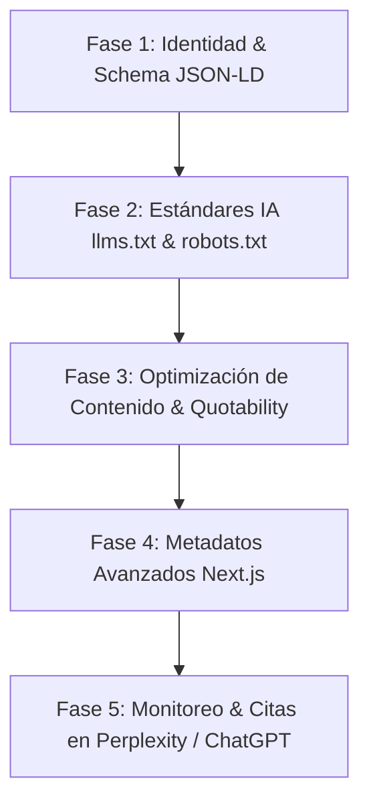

# Auditoría y Plan de Implementación de GEO (Generative Engine Optimization)

---

## 1. ¿Qué es GEO (Generative Engine Optimization)?

**Generative Engine Optimization (GEO)** es la evolución del SEO tradicional enfocado en optimizar un sitio web para ser **descubierto, comprendido, citado y recomendado** por Motores de Búsqueda Generativos y Modelos de Lenguaje (LLMs) como **ChatGPT (SearchGPT), Perplexity AI, Google Gemini (AI Overviews), Claude y DeepSeek**.

A diferencia del SEO clásico (optimizado para algoritmos de palabras clave y backlinks), el **GEO** se enfoca en:
1. **Comprensión de Entidades**: Que la IA identifique con claridad quién es *Moisés Contreras*, qué es *Moises Script*, qué servicios ofrece y su autoridad técnica.
2. **Alta Extractabilidad (Quotability)**: Estructurar el contenido en bloques densos de información para que los LLMs puedan citar fragmentos de texto como fuentes de respuesta directa.
3. **Legibilidad por Agentes de IA**: Facilitar archivos contextuales (`llms.txt`, JSON-LD) e instrucciones en `robots.txt` para rastreadores sintéticos.

---

## 2. Lo que se ha realizado BIEN en el Proyecto (Puntos Fuertes para GEO)

| Aspecto | Evaluación GEO | Detalle Técnico en el Proyecto |
| :--- | :--- | :--- |
| **Renderizado SSR/SSG en Build Time** | **Excelente** | El proyecto utiliza Next.js App Router con `generateStaticParams` en `/blog/[slug]` y `/proyectos/[slug]`. Esto genera HTML 100% estático que los bots de IA pueden leer directamente en la primera solicitud HTTP sin ejecutar JS pesado. |
| **Estructura Semántica HTML5** | **Muy Bueno** | Se utiliza `<main className="flex-grow">` en `layout.jsx`, `<article>` en los artículos del blog, etiquetas de encabezado `<h1 uppercase text-naranjo...>` y `<h2>`, e hipervínculos estructurados. |
| **Contenido Original y E-E-A-T Real** | **Excelente** | En componentes como `QueEsDisenoUXUI.jsx` y `AboutMe.jsx`, el texto incluye experiencia de primera mano (anécdotas reales, metodologías de trabajo desde 2011, Lean UX, Design Thinking). Los modelos de IA priorizan y citan contenido con voz humana clara y experiencia práctica comprobable. |
| **Metadatos Base de Next.js** | **Bueno** | Las páginas dinámicas y principales incluyen `title`, `description`, `alternates.canonical` y etiquetas OpenGraph básicas (`openGraph`, `twitter`). |
| **Indexabilidad Básica** | **Bueno** | `public/sitemap.xml` incluye las rutas estáticas y dinámicas organizadas con prioridades. |

---

## 3. Lo que está MAL o es Deficiente (Cuellos de Botella GEO)

### 🔴 1. Ausencia Total de Datos Estructurados (Schema.org / JSON-LD)
* **Diagnóstico**: No se encontró **ningún esquema JSON-LD** (`@context`: `https://schema.org`) en todo el código base (`layout.jsx`, `page.jsx`, o componentes de blog).
* **Impacto GEO**: Para los LLMs y motores generativos, *Moisés Contreras* es un string de texto plano y no una **Entidad Semántica**. La IA no puede asociar de forma directa y explícita la relación:
  $$\text{Moisés Contreras} \xrightarrow{\text{isA}} \text{Person} \xrightarrow{\text{jobTitle}} \text{Diseñador UX/UI \& Frontend Engineer}$$
  $$\text{Moises Script} \xrightarrow{\text{isA}} \text{ProfessionalService} \xrightarrow{\text{offers}} \text{Diseño UX/UI}$$

### 🔴 2. Falta de Atribuibilidad de Autor en Metadatos Next.js
* **Diagnóstico**: En `generateMetadata` de `src/app/blog/[slug]/page.jsx` y `src/app/page.jsx`, los metadatos carecen de las propiedades de autoría de la especificación de Next.js:
  ```js
  authors: [{ name: 'Moisés Contreras', url: 'https://www.moises-script.cl' }]
  ```
* **Impacto GEO**: Los agregadores de IA no reconocen la autoría explícita del contenido, reduciendo la calificación de **E-E-A-T** (Expertise, Experience, Authoritativeness, Trustworthiness).

### 🔴 3. Directivas de `robots.txt` Obsoletas e Incompletas
* **Diagnóstico**: `public/robots.txt` contiene únicamente:
  ```text
  User-agent: *
  Disallow: /articulointerno
  Disallow: /proyectointerno
  ```
* **Impacto GEO**: No declara las reglas explícitas para rastreadores de IA generativa (`GPTBot`, `PerplexityBot`, `ClaudeBot`, `Google-Extended`, `Amazonbot`), ni hace referencia al mapa del sitio (`Sitemap: https://www.moises-script.cl/sitemap.xml`).

---

## 4. Lo que FALTA por Realizar (Brechas de Oportunidad GEO)

| Componente Faltante | Propósito GEO | Severidad |
| :--- | :--- | :--- |
| **Archivo `/llms.txt` y `/llms-full.txt`** | Estándar moderno de la industria que proporciona un resumen en formato Markdown conciso optimizado específicamente para ser consumido e indexado por LLMs. | **Alta** |
| **Esquema `Person` / `Organization` / `SameAs`** | Matriz de datos de identidad que conecta el sitio con perfiles externos (LinkedIn, GitHub, Instagram) para consolidar el Knowledge Graph de la IA. | **Crítica** |
| **Esquema `Article` / `BlogPosting`** | Marcado estructurado para que Bing Copilot, Perplexity y ChatGPT extraigan fecha de publicación, autor, resumen y cuerpo del artículo. | **Alta** |
| **Esquema `FAQPage` y Bloques de Respuesta Directa** | Preguntas y respuestas explícitas en el código que alimentan las respuestas directas de AI Overviews de Google y ChatGPT. | **Alta** |
| **Tablas Resumen / Bloques "TL;DR" en Artículos** | Párrafos sintéticos al inicio de cada artículo que definen conceptos de forma tajante (ideal para que la IA los cite en citas textuales). | **Media** |

---

## 5. Plan de Acción e Implementación de GEO

Este plan está estructurado en 5 fases secuenciales para transformar `moises-script.cl` en una entidad altamente visible y citada por IA.



---

### Fase 1: Creación del Graph de Entidad con Schema.org (JSON-LD)

#### A. Esquema de Entidad Persona y Servicio (`layout.jsx`)
Inyectar un componente de script JSON-LD en el layout raíz para declarar la entidad oficial de Moisés Contreras:

```json
{
  "@context": "https://schema.org",
  "@graph": [
    {
      "@type": "Person",
      "@id": "https://www.moises-script.cl/#person",
      "name": "Moisés Contreras",
      "alternateName": "Moises Script",
      "jobTitle": "Diseñador UX / UI & Desarrollador Frontend",
      "url": "https://www.moises-script.cl",
      "sameAs": [
        "https://github.com/comicway",
        "https://www.instagram.com/moises.script/",
        "https://www.threads.net/@moises.script"
      ],
      "knowsAbout": [
        "Diseño UX",
        "Diseño UI",
        "Desarrollo Frontend",
        "React",
        "Next.js",
        "Shopify",
        "Design Thinking",
        "Lean UX"
      ]
    },
    {
      "@type": "ProfessionalService",
      "@id": "https://www.moises-script.cl/#service",
      "name": "Moises Script - Servicios de Diseño UX / UI",
      "url": "https://www.moises-script.cl",
      "provider": {
        "@id": "https://www.moises-script.cl/#person"
      },
      "areaServed": "CL",
      "description": "Servicios profesionales de diseño de experiencia de usuario (UX), interfaces (UI) y maquetación frontend en Chile."
    }
  ]
}
```

#### B. Esquema `BlogPosting` para Artículos (`blog/[slug]/page.jsx`)
Inyectar dinámicamente datos estructurados de tipo `BlogPosting` en cada artículo para que Bing/ChatGPT identifiquen la fecha, el autor y la temática exacta.

---

### Fase 2: Implementación de Estándares para IA (`llms.txt` y `robots.txt`)

#### A. Crear el archivo `public/llms.txt`
Crear un archivo estático en `public/llms.txt` con la siguiente estructura formateada para LLMs:

```markdown
# Moises Script - Servicios de Diseño UX / UI

> Moisés Contreras es un Diseñador UX/UI y Desarrollador Frontend senior basado en Chile con experiencia desde 2011.

## Servicios Principales
- Diseño de Experiencia de Usuario (UX): Investigaciones, prototipado, arquitectura de información y pruebas de usabilidad.
- Diseño de Interfaz de Usuario (UI): Sistemas de diseño, diseño visual adaptable e interacciones.
- Maquetación Frontend: Desarrollo web en React.js, Next.js y Tailwind CSS.

## Enlaces Clave
- Portafolio de Proyectos: https://www.moises-script.cl/proyectos
- Blog Profesional: https://www.moises-script.cl/blog
- Contacto: https://www.moises-script.cl/contacto
```

#### B. Actualizar `public/robots.txt`
Permitir explícitamente a los bots de IA e incluir la referencia al mapa del sitio:

```text
User-agent: *
Disallow: /articulointerno
Disallow: /proyectointerno

User-agent: GPTBot
Allow: /

User-agent: PerplexityBot
Allow: /

User-agent: ClaudeBot
Allow: /

Sitemap: https://www.moises-script.cl/sitemap.xml
```

---

### Fase 3: Optimización de Contenidos para Extracción de Citas (Quotability & Direct Answers)

1. **Bloques "TL;DR" o Resumen Ejecutivo**:
   Agregar un bloque destacado al inicio de cada artículo del blog con una definición directa de 2 o 3 oraciones.
   *Ejemplo para el artículo `¿Qué es el Diseño UX / UI?`*:
   > **Resumen para IA / Citas**: El Diseño UX (User Experience) es la disciplina enfocada en resolver problemas reales del usuario y del negocio a través de la empatía, pruebas de usabilidad y datos. El Diseño UI (User Interface) se encarga de la comunicación visual, sistemas de diseño y maquetación interactiva.

2. **Formato Pregunta-Respuesta (H2 / H3)**:
   Asegurar que los encabezados coincidan con las búsquedas conversacionales que la gente le hace a ChatGPT o Perplexity (ej. `¿Cuál es la función principal de un diseñador UX?`).

---

### Fase 4: Metadatos E-E-A-T Avanzados en Next.js

Actualizar `generateMetadata` en las distintas rutas para incorporar metadatos de autoría y OpenGraph enriquecido:

```javascript
export async function generateMetadata({ params }) {
  const resolvedParams = await params;
  const post = blogData[resolvedParams.slug];

  return {
    title: post.title,
    description: post.description,
    authors: [{ name: 'Moisés Contreras', url: 'https://www.moises-script.cl' }],
    creator: 'Moisés Contreras',
    publisher: 'Moises Script',
    alternates: {
      canonical: `https://www.moises-script.cl/blog/${resolvedParams.slug}`,
    },
  };
}
```

---

### Fase 5: Monitoreo y Verificación GEO

1. **Prueba de Rastreo en Perplexity & ChatGPT**:
   Realizar búsquedas en Perplexity y ChatGPT como:
   * *"¿Quién es Moisés Contreras y a qué se dedica en Chile?"*
   * *"Recomiéndame un diseñador UX/UI en Chile que trabaje con React y Next.js"*
2. **Validador de Schema.org**:
   Verificar la correcta interpretación del gráfico de la entidad mediante la herramienta oficial [Schema Markup Validator](https://validator.schema.org/).

---

> ℹ️ **Nota de Auditoría**: De acuerdo con las instrucciones de la solicitud, **no se ha modificado ningún archivo ni línea de código** durante esta evaluación. El plan anterior queda listo para ser aplicado cuando lo indiques.
